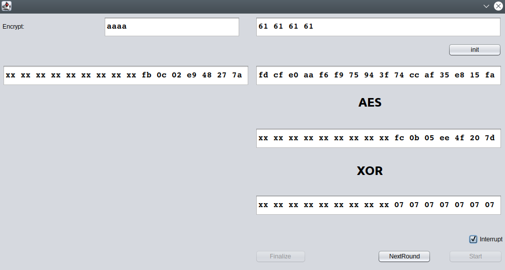
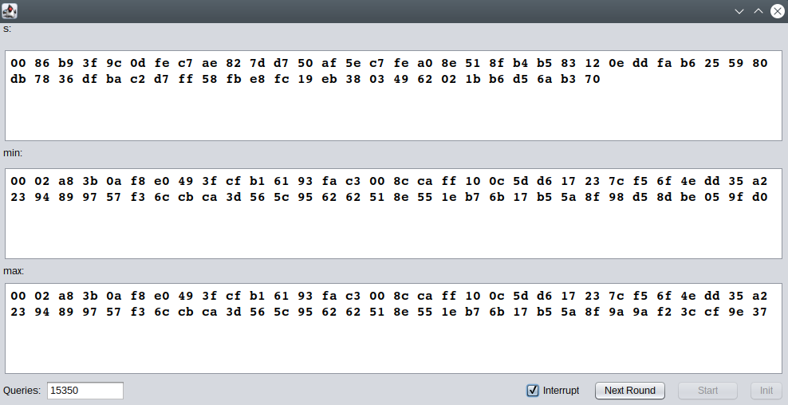

# Crypto Attacks
Examples of cryptographic attacks for lecture presentations. It contains Bleichenbacher and padding oracle attacks.

You can compile it using:
```
mvn package
```

## CBC padding Oracles
Running:
```
mvn exec:java -Dexec.mainClass=de.upb.syssec.cryptoattacks.cbc.TestFrame
```


## Bleichenbacher's Attack
Running:
```
mvn exec:java -Dexec.mainClass=de.upb.syssec.cryptoattacks.pkcs15.TestFrame
```
The attack executes the basic Bleichenbacher algorithm with a randomly generated valid PKCS#1v1.5 message against the simplest oracle checking only the first two leading bytes (00 02). It is the TTT oracle according to the paper by Bardou et al. (https://eprint.iacr.org/2012/417.pdf)



## Misc
The code was tested with Apache Maven 3.6.3 and Java 8/14.

I am not a Java Swing programmer. Some of the stuff what I do is quite ugly...but I am happy that it works somehow :)